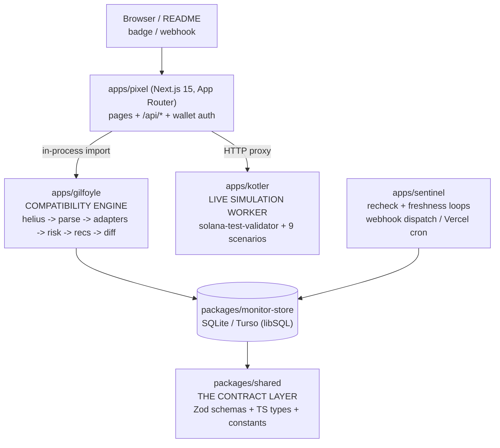
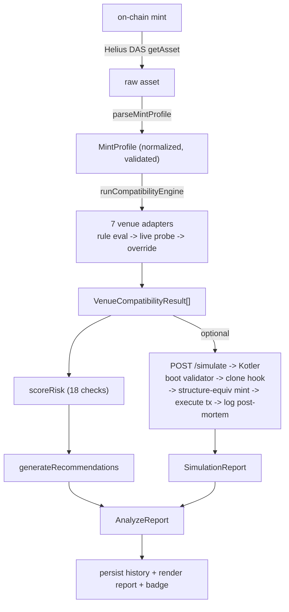
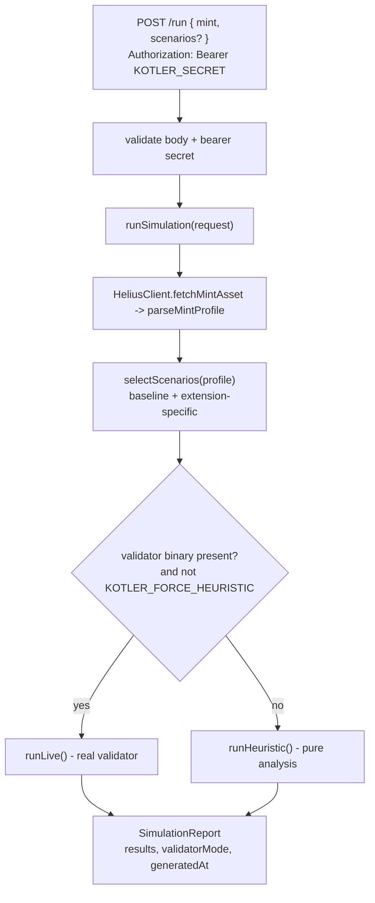

# Tarani

**Token-2022 compatibility intelligence for Solana.**

Paste any mint address and Tarani produces an instant, evidence-backed compatibility report across **7 ecosystem venues** (Jupiter, Raydium, Orca, Phantom, Solflare, Solscan, Solana Explorer), a ranked list of trust/compatibility risks, actionable remediations, an optional **high-fidelity on-chain simulation**, continuous monitoring with webhook alerts, and an embeddable status badge.

The thesis: SPL **Token-2022** ships ~20 mint extensions (transfer fees, transfer hooks, confidential transfers, permanent delegates, non-transferable, default-frozen state, …). Each extension interacts differently with each downstream protocol. A token that initializes fine on-chain can still be **silently un-routable on Jupiter, un-poolable on Raydium, or unrenderable in Phantom**. Tarani answers _"before you launch, where will this token break?"_ — with rule-derived verdicts, live protocol probes, and real transaction execution.

---

## Table of contents

1. [System architecture (HLD)](#1-system-architecture-hld)
2. [Pillar I — The `MintProfile` generation engine](#2-pillar-i--the-mintprofile-generation-engine)
3. [Pillar II — The compatibility engine](#3-pillar-ii--the-compatibility-engine)
4. [Pillar III — Live on-chain simulation (Kotler)](#4-pillar-iii--live-on-chain-simulation-kotler)
5. [Monitoring, diffing & alerts](#5-monitoring-diffing--alerts)
6. [Codebase map (domain-driven)](#6-codebase-map-domain-driven)
7. [Local setup](#7-local-setup)
8. [Running the simulation worker](#8-running-the-simulation-worker)
9. [Testing & CI](#9-testing--ci)
10. [Deployment](#10-deployment)

---

## 1. System architecture (HLD)

Tarani is a **Bun workspace monorepo** of four applications and three packages. A single contract package (`@tarani/shared`) defines every Zod schema and type; every other module is a typed consumer of it. The system converges on one canonical payload — the **`AnalyzeReport`**.



**End-to-end data flow:**



---

## 2. Pillar I — The `MintProfile` generation engine

> Location: [`apps/gilfoyle/src/helius/`](apps/gilfoyle/src/helius/) and [`apps/gilfoyle/src/parser/`](apps/gilfoyle/src/parser/)

### 2.1 Acquisition strategy: DAS over raw account scraping

A naive analyzer issues `getAccountInfo`, then hand-decodes the raw account buffer with a layout decoder to walk the Token-2022 TLV (type-length-value) extension region. That is brittle: extension layouts version independently, and the analyzer must re-implement the on-chain TLV walker for every new extension.

Tarani instead sources state from the **Helius Digital Asset Standard (DAS) API** via the `getAsset` JSON-RPC method. Helius performs the TLV decode server-side and returns a structured `mint_extensions` object plus consolidated `token_info`, `authorities`, and `content.metadata`. This trades a layout dependency for an RPC dependency — and lets the engine focus on **normalization and semantic interpretation** rather than byte-walking.

`HeliusClient` ([`client.ts`](apps/gilfoyle/src/helius/client.ts)) hardens that call:

- **Base58 guard** — rejects anything that isn't a 32–44 character base58 string (the canonical Solana address shape) before any network I/O.
- **Process-wide cache** — 5-minute TTL, shared across instances (memoizes hot mints).
- **Bounded latency** — `AbortController` with a 5 s timeout per attempt.
- **Typed error taxonomy** — HTTP/RPC outcomes map onto a closed `ApiErrorCode` union (`429 → RATE_LIMITED`, `≥500 → UPSTREAM_ERROR`, null result `→ NOT_FOUND`).
- **Selective retry** — only `UPSTREAM_TIMEOUT`/`UPSTREAM_ERROR` are retried, with base-4 backoff (`200ms · 4^attempt` → 200 ms, 800 ms, 3.2 s).

### 2.2 The normalization pipeline

`parseMintProfile(asset)` ([`parseMint.ts`](apps/gilfoyle/src/parser/parseMint.ts)) is a pure function (no I/O) composing three normalizers, accumulating non-fatal `ParserWarning`s rather than throwing:

| Normalizer                                                                 | Responsibility                                                   | Notable behavior                                                                                                               |
| -------------------------------------------------------------------------- | ---------------------------------------------------------------- | ------------------------------------------------------------------------------------------------------------------------------ |
| [`normalizeExtensions`](apps/gilfoyle/src/parser/normalizeExtensions.ts)   | snake_case RPC keys → camelCase `ExtensionKind` enum             | Unmapped keys → `kind: "unknown"` + `UNKNOWN_EXTENSION` warning (never dropped). Sorted by `rawKind` for deterministic output. |
| [`normalizeAuthorities`](apps/gilfoyle/src/parser/normalizeAuthorities.ts) | resolve mint/freeze/update/metadata authorities                  | Fallback chain: `token_info` → extension authorities → `authorities[]` scopes. `isRenounced = (address === null)`.             |
| [`normalizeMetadata`](apps/gilfoyle/src/parser/normalizeMetadata.ts)       | merge on-chain `tokenMetadata` with off-chain `content.metadata` | **On-chain wins**; off-chain fills gaps. `quality` = count of `{name, symbol, uri}` present (3 → `complete`, 0 → `missing`).   |

The result is validated against `mintProfileSchema` before it leaves the engine.

### 2.3 The `MintProfile` contract

> Defined in [`packages/shared/src/schemas/mint.schema.ts`](packages/shared/src/schemas/mint.schema.ts) as a Zod schema; the TypeScript type below is its `z.infer`.

```typescript
type ExtensionKind =
  | "transferFeeConfig"
  | "transferHook"
  | "defaultAccountState"
  | "permanentDelegate"
  | "nonTransferable"
  | "interestBearingConfig"
  | "cpiGuard"
  | "memoTransfer"
  | "confidentialTransferMint"
  | "confidentialTransferFeeConfig"
  | "metadataPointer"
  | "tokenMetadata"
  | "groupPointer"
  | "tokenGroup"
  | "groupMemberPointer"
  | "tokenGroupMember"
  | "mintCloseAuthority"
  | "scaledUiAmountConfig"
  | "pausable"
  | "unknown";

interface DetectedExtension {
  kind: ExtensionKind; // normalized enum
  rawKind: string; // original RPC key (audit trail)
  parameters: Record<string, unknown>; // decoded extension params
  raw: unknown; // verbatim source (forensics)
}

interface AuthorityRecord {
  kind: "mint" | "freeze" | "update" | "metadata";
  address: string | null; // null ⇔ renounced
  isRenounced: boolean;
}

interface MetadataProfile {
  name?: string;
  symbol?: string;
  uri?: string;
  decimals: number; // 0–255
  quality: "complete" | "partial" | "missing";
  hasOnChainName: boolean; // written via TokenMetadata ext?
  hasOnChainSymbol: boolean;
}

interface ParserWarning {
  code:
    | "UNKNOWN_EXTENSION"
    | "MISSING_METADATA_URI"
    | "MISSING_METADATA_NAME"
    | "MISSING_METADATA_SYMBOL"
    | "INVALID_AUTHORITY_FORMAT"
    | "MISSING_SUPPLY"
    | "MISSING_DECIMALS"
    | "UNRECOGNIZED_PROGRAM_ID";
  message: string;
  path?: string; // e.g. "token_info.supply"
}

interface MintProfile {
  mint: string; // base58, 32–44 chars
  programId: string; // Token vs Token-2022 program
  supply: string; // numeric STRING — preserves u64 precision
  decimals: number; // 0–255
  extensions: DetectedExtension[];
  authorities: {
    mint: AuthorityRecord;
    freeze: AuthorityRecord;
    update: AuthorityRecord;
    metadata?: AuthorityRecord;
  };
  metadata: MetadataProfile;
  warnings: ParserWarning[];
  fetchedAt: string; // ISO-8601
}
```

> **Design note.** `supply` is a **string**, not a `number`. A u64 supply exceeds `Number.MAX_SAFE_INTEGER`; serializing it as a float silently corrupts large-supply tokens. Carrying it as a `/^\d+$/` string preserves exact precision through the entire pipeline.

---

## 3. Pillar II — The compatibility engine

> Location: [`apps/gilfoyle/src/adapters/`](apps/gilfoyle/src/adapters/), [`apps/gilfoyle/src/rules/`](apps/gilfoyle/src/rules/), [`apps/gilfoyle/src/risk/`](apps/gilfoyle/src/risk/)

The compatibility engine is a **declarative rule + live-probe + override** pipeline. Each venue's behavior is captured as a hand-maintained, schema-validated JSON rule; an evaluator interprets a `MintProfile` against it; select adapters then refine the verdict with live protocol probes; a manual override layer is the final escape hatch.

### 3.1 The adapter pattern

```typescript
interface VenueAdapter {
  readonly venue: VenueId;
  evaluate(input: {
    profile: MintProfile;
    rule: VenueRule;
  }): VenueCompatibilityResult | Promise<VenueCompatibilityResult>;
}
```

`runCompatibilityEngine(profile)` ([`engine.ts`](apps/gilfoyle/src/adapters/engine.ts)) loads all 7 venue rules, runs every adapter in `Promise.all`, and applies overrides to each result. Four adapters (Phantom, Solflare, Solscan, Solana Explorer) are **pure rule evaluators**; three (Jupiter, Raydium, Orca) layer a **live HTTP probe** on top.

### 3.2 Rule schema

> [`rules/schema/venueRule.schema.json`](apps/gilfoyle/rules/schema/venueRule.schema.json) (JSON Schema draft-07), validated in CI by [`scripts/validate-rules.ts`](apps/gilfoyle/scripts/validate-rules.ts).

```jsonc
{
  "venue": "jupiter",
  "version": "1.2.0",
  "last_updated": "2026-04-18", // drives freshness checks
  "features": [
    {
      "id": "transferFeeConfig", // matches an ExtensionKind
      "scope": "limitOrders", // optional venue sub-feature
      "status": "blocked", // supported|partial|blocked|conditional|unknown
      "confidence": "high", // high|medium|low (defaults low)
      "evidence": ["https://station.jup.ag/docs/..."],
      "notes": ["Fee-on-transfer breaks limit-order escrow accounting"],
    },
  ],
  "notes": ["..."],
}
```

### 3.3 Formal evaluation model

The status space forms a **severity lattice** ranked by `STATUS_RANK` ([`evaluator.ts`](apps/gilfoyle/src/adapters/evaluator.ts)):

$$\textsf{blocked}\ (5) \succ \textsf{conditional}\ (4) \succ \textsf{partial}\ (3) \succ \textsf{unknown}\ (2) \succ \textsf{supported}\ (1)$$

For a mint with extension set $E$ and a venue rule with feature set $F$, the engine builds the set of **applicable unscoped verdicts** $V$ — the rule features $f \in F$ whose extension $\mathrm{id}(f) \in E$ and whose $\mathrm{scope}(f) = \varnothing$.

The **overall venue status** $s'$ is the worst (highest-ranked) applicable verdict — a _fail-pessimistic_ aggregation:

$$\mathrm{rank}(s') \ =\ \max_{f \in V}\ \mathrm{rank}(\mathrm{status}(f))$$

with $s' = \textsf{supported}$ when $E = \varnothing$ (an extension-free SPL token is universally supported by construction), and $s' = \textsf{unknown}$ when $V = \varnothing$.

**Confidence** $c'$ is the _minimum_ confidence among the verdicts that actually drove $s'$, with ranks $\textsf{high}\ (3) \succ \textsf{medium}\ (2) \succ \textsf{low}\ (1)$:

$$\mathrm{crank}(c') \ =\ \min_{f \in V,\ \mathrm{status}(f)\ =\ s'}\ \mathrm{crank}(\mathrm{confidence}(f))$$

This prevents a high-confidence `blocked` verdict from inflating the confidence of a `supported` result. **Scoped** verdicts (e.g. Jupiter `swap` vs `limitOrders`) do not enter $V$; they populate a per-feature map `features[scope]`, each computed by the same procedure over its own scope.

### 3.4 Live probes & verdict refinement

A rule-derived verdict carries `source: "heuristic"`. Three adapters then _refine_ it against live protocol state and promote `source` accordingly:

| Adapter     | Probe endpoint                                                                                        | Refinement rule                                    |
| ----------- | ----------------------------------------------------------------------------------------------------- | -------------------------------------------------- |
| **Jupiter** | `lite-api.jup.ag/swap/v1/quote`                                                                       | no route ⇒ `supported → partial`                   |
| **Orca**    | `api.mainnet.orca.so/v1/whirlpool/list` (≈18 MB, process-cached, 5-min TTL, single in-flight promise) | live pool ⇒ `conditional → supported`              |
| **Raydium** | `api-v3.raydium.io/pools/info/mint`                                                                   | appends pool-existence evidence (no status change) |

Probe failures (`unknown`) leave the heuristic verdict untouched — the engine never degrades on its own network errors. The synthetic prelaunch sentinel mint skips probes entirely.

**Precedence (final word last):** `heuristic` → `probe` → `override`. `applyOverride` ([`overrides.ts`](apps/gilfoyle/src/adapters/overrides.ts)) reads [`rules/overrides.json`](apps/gilfoyle/rules/overrides.json) and can force any verdict, stamping `source: "override"` with the human-authored reason as evidence.

### 3.5 Risk scoring & remediation

`scoreRisk(profile, compatibility)` ([`riskEngine.ts`](apps/gilfoyle/src/risk/riskEngine.ts)) runs **18 deterministic checks** across four modules, dedups by `id`, and sorts by `(severity, category)`:

- **Authority** — un-renounced mint (`HIGH`), freeze (`MED`), update (`MED`), metadata (`MED`); active permanent delegate (`HIGH`).
- **Extension** — incompatible combinations are `CRITICAL`: `nonTransferable × transferHook`, `nonTransferable × transferFee`, `confidentialTransfer × transferHook`, `confidentialTransfer × transferFee`; `confidential × permanentDelegate` is `HIGH`; lone transfer fee is `MED`.
- **Compatibility** — blocked on _all_ DEXes (`CRITICAL`), blocked on _some_ (`HIGH`), conditional venues (`MED`), all-unknown (`INFO`).
- **Metadata** — missing (`HIGH`), partial (`MED`), off-chain-only name (`LOW`).

Findings are ordered by:

$$
\mathrm{sevrank}: \textsf{critical} \prec \textsf{high} \prec \textsf{medium} \prec \textsf{low} \prec \textsf{info}, \qquad
\mathrm{catrank}: \textsf{authority} \prec \textsf{extension} \prec \textsf{compatibility} \prec \textsf{metadata} \prec \dots
$$

`generateRecommendations(risks)` then maps each `RiskFinding.id` to a remediation template in [`recommendations.json`](apps/gilfoyle/rules/recommendations.json), emitting `Recommendation`s back-linked via `riskIds`.

**Derived report grade.** The embeddable badge ([`badgeRenderer.ts`](apps/pixel/src/lib/badgeRenderer.ts)) collapses the venue vector to a single grade over $n$ venues, with $b$ blocked and $k$ supported:

| Grade | Condition                       |
| ----- | ------------------------------- |
| **F** | $b > 0$ (any venue blocked)     |
| **A** | $b = 0$ and $k/n \ge 0.8$       |
| **B** | $b = 0$ and $0.5 \le k/n < 0.8$ |
| **C** | otherwise                       |

### 3.6 Prelaunch & diff

- **Prelaunch** ([`profileBuilder.ts`](apps/gilfoyle/src/prelaunch/profileBuilder.ts)) — `buildPrelaunchProfile(config)` synthesizes a `MintProfile` (mint = `PRELAUNCH_MINT_SENTINEL`, supply `"0"`, placeholder authorities) from a hypothetical extension/decimals/authority config, then runs it through the **identical** engine. Configure-before-you-deploy.
- **Diff** ([`diffEngine.ts`](apps/gilfoyle/src/diff/diffEngine.ts)) — `diffCompatibility(before, after)` emits `improved | degraded | changed` per venue using a status-rank delta. Powers monitoring.

---

## 4. Pillar III — Live on-chain simulation (Kotler)

> Location: [`apps/kotler/src/`](apps/kotler/src/) — a standalone Bun HTTP service.

Rules and probes tell you what _should_ happen. **Kotler proves what _does_ happen** by executing real transactions against a real validator. This is the project's technical moat: instead of mocking outcomes, it boots an ephemeral `solana-test-validator`, constructs a **structure-equivalent Token-2022 mint** that mirrors the target's extension profile, runs behavioral scenarios as genuine on-chain transactions, and performs a post-mortem on the program logs.

> **Honest scope.** Kotler does **not** fork mainnet ledger slots or clone the live mint account. It (a) optionally `--clone`s the target's _transfer-hook program_ into the local ledger, and (b) **re-creates** a mint locally with the same extensions via `createInitializeMint*` instructions. This isolates extension _behavior_ deterministically and cheaply. Where on-chain replication is impossible (e.g. a freeze authority Tarani does not control), the scenario transparently falls back to heuristic analysis and labels itself accordingly. Fidelity is high, but it is a **structure-equivalent harness**, not a mainnet fork.

### 4.1 Request lifecycle



### 4.2 The validator lifecycle (`runLive`)

[`validator/lifecycle.ts`](apps/kotler/src/validator/lifecycle.ts) + [`worker/liveRunner.ts`](apps/kotler/src/worker/liveRunner.ts):

1. **Free-port scan** — probe `127.0.0.1:8899-8998` for an open RPC port.
2. **Boot** — spawn the validator with the program clone list:
   ```
   solana-test-validator --rpc-port <port> --quiet [--clone <hookProgramId> ...]
   ```
   When the target mint has a `transferHook` extension, its program id is added to the clone set so the hook bytecode exists in the local ledger.
3. **Health gate** — poll `getHealth` over JSON-RPC until ready (30 s ceiling, `ValidatorBootTimeoutError` on miss).
4. **Ephemeral funding** — generate a fresh payer `Keypair` and `connection.requestAirdrop(payer, 2 SOL)` on the _local_ validator.
5. **Structure-equivalent mint** — [`mintSetup.ts`](apps/kotler/src/validator/mintSetup.ts) builds the extension-init instructions matching the profile (TransferFee, DefaultAccountState, PermanentDelegate, NonTransferable) and `createInitializeMintInstruction`s a new Token-2022 mint.
6. **Scenario execution** — for each selected scenario, `SCENARIO_REGISTRY[kind].live(ctx)` crafts and `sendAndConfirm`s a real transaction.
7. **Teardown** — `stopValidator()` kills the process; the ledger is ephemeral.

### 4.3 The scenario matrix

`SCENARIO_REGISTRY` ([`scenarios/index.ts`](apps/kotler/src/scenarios/index.ts)) holds **9 scenarios**, each implementing both a `heuristic(ctx)` and a `live(ctx)` path:

| Scenario                  | Live behavior                                                             |
| ------------------------- | ------------------------------------------------------------------------- |
| `transfer`                | mint + transfer 500k units; detects `nonTransferable` / `pausable` blocks |
| `transfer_fee`            | transfer and measure withheld fee against basis-points config             |
| `transfer_hook`           | attempt transfer with the cloned hook program in-ledger                   |
| `memo_required`           | transfer without memo (expect block) then with an SPL-Memo instruction    |
| `associated_token_create` | create an ATA; report frozen state under `defaultAccountState`            |
| `freeze_check`            | delegates to heuristic — freeze authority can't be replicated             |
| `metadata_check`          | delegates to heuristic — pure metadata analysis                           |
| `swap`                    | probe Jupiter Quote for a live route                                      |
| `wrap_sol`                | probe Raydium for pool existence                                          |

### 4.4 State post-mortem

[`worker/logParser.ts`](apps/kotler/src/worker/logParser.ts) inspects the confirmed-transaction response and extracts a structured outcome:

```typescript
const LOG_ERR_RE = /Error:\s*(.+)/i;
const FAILURE_CODE_RE = /custom program error:\s*(0x[0-9a-f]+|\d+)/i;
```

Each scenario resolves to a `ScenarioResult`:

```typescript
interface ScenarioResult {
  id: string;
  kind: ScenarioKind;
  outcome: "success" | "blocked" | "warning" | "error";
  summary: string;
  durationMs: number;
  failureCode?: string; // e.g. "0x1772" — the on-chain custom program error
  logs?: string[]; // captured program log lines
}
```

A blocked transfer surfaces as `outcome: "blocked"` with the program's `custom program error` code — concrete, on-chain evidence of an extension gate rather than a guessed verdict.

---

## 5. Monitoring, diffing & alerts

> [`packages/monitor-store/`](packages/monitor-store/) + [`apps/sentinel/`](apps/sentinel/)

`monitor-store` is a driver-abstracted SQLite layer with two backends — **Turso/libSQL** (production) and **better-sqlite3** (local/test) — over a shared `DbDriver` interface. Notable invariants:

- `monitored_mints` is unique on **(subscriber_id, mint)** — one mint watched by _N_ users yields _N_ subscriptions but **one shared snapshot**; `listDistinctMints()` dedups so rechecks fetch once.
- **Atomic rate limiting** — a single `INSERT ... SELECT WHERE COUNT(window) < max` exploits SQLite's serialized writer for race-free sliding windows.
- **Webhooks** — HTTPS-only (plaintext refused), 5 s timeout, per-hook error isolation (one failure never sinks the batch).

The **sentinel** runs two overlap-guarded loops: a **recheck loop** (default 60 s) that re-analyzes each tracked mint, `diffCompatibility`s against the last snapshot, persists changes, and dispatches webhooks; and a **freshness loop** (default 24 h) that re-alerts only when the _set_ of stale venue rules changes. On Vercel the same logic runs as a daily cron hitting `/api/sentinel/tick` (guarded by `CRON_SECRET`).

---

## 6. Codebase map (domain-driven)

```
tarani/
|-- apps/
|   |-- pixel/                         # Next.js 15 - UI + API + wallet auth
|   |   |-- app/
|   |   |   |-- page.tsx               #   / - mint input
|   |   |   |-- report/[mint]/page.tsx #   server-rendered report
|   |   |   |-- prelaunch/page.tsx     #   pre-launch config analyzer
|   |   |   |-- dashboard/page.tsx     #   authenticated watchlist
|   |   |   \-- api/
|   |   |       |-- analyze/route.ts   #   POST -> compatibility engine
|   |   |       |-- simulate/route.ts  #   POST -> proxy to Kotler
|   |   |       |-- badge/[mint]/      #   GET  -> SVG status badge
|   |   |       |-- auth/{nonce,verify,me,logout}/   # wallet sign-in
|   |   |       |-- monitor/{,[mint]}/ #   watchlist CRUD (authed)
|   |   |       |-- webhooks/{,[id]}/  #   webhook registration
|   |   |       \-- sentinel/tick/     #   cron entrypoint (CRON_SECRET)
|   |   |-- components/                #   matrix, risk, recs, simulation UI
|   |   \-- src/lib/                   #   auth (HMAC), rateLimiter, db, badgeRenderer
|   |
|   |-- gilfoyle/                      # COMPATIBILITY ENGINE
|   |   |-- src/helius/                #   DAS client + error taxonomy + types
|   |   |-- src/parser/                #   parseMintProfile + 3 normalizers
|   |   |-- src/adapters/              #   engine, evaluator, 7 venue adapters, overrides
|   |   |-- src/risk/                  #   riskEngine + checks/{authority,extension,compatibility,metadata}
|   |   |-- src/recommendations/       #   recommendationEngine + remediations
|   |   |-- src/prelaunch/             #   synthetic profile builder
|   |   |-- src/diff/                  #   compatibility diff engine
|   |   |-- src/rules/                 #   loadRules + freshness logic
|   |   |-- rules/venues/*.json        #   7 hand-maintained venue rules
|   |   |-- rules/schema/*.json        #   JSON-Schema validators
|   |   \-- scripts/                   #   validate-rules, check-freshness, smoke-parse
|   |
|   |-- kotler/                        # LIVE SIMULATION WORKER
|   |   |-- src/server.ts              #   Bun HTTP /run (+ bearer auth)
|   |   |-- src/validator/             #   lifecycle (boot/clone/teardown) + mintSetup
|   |   |-- src/worker/                #   runSimulation, liveRunner, heuristicRunner, logParser
|   |   \-- src/scenarios/             #   9 behavioral scenarios (live + heuristic)
|   |
|   \-- sentinel/                      # MONITORING WORKER
|       \-- src/                       #   recheckLoop, freshnessLoop, alertDispatcher
|
|-- packages/
|   |-- shared/src/                    # CONTRACT LAYER: schemas + types + constants
|   |-- monitor-store/src/             #   SQLite/Turso store, dispatch, rate-limit
|   \-- test-fixtures/                 #   USDC, PYUSD, transfer-hook, synthetic mints
|
|-- vitest.config.ts                   # coverage gate (66% lines / 75% fn / 86% branch)
|-- eslint.config.mjs, tsconfig.json
\-- apps/pixel/vercel.json             # sentinel cron: "0 6 * * *"
```

---

## 7. Local setup

### 7.1 Prerequisites

| Tool                                                              | Version                 | Needed for                                                                         |
| ----------------------------------------------------------------- | ----------------------- | ---------------------------------------------------------------------------------- |
| **[Bun](https://bun.sh)**                                         | ≥ 1.1 (repo pins 1.3.9) | runtime, package manager, test runner — **required**                               |
| **Helius API key**                                                | free tier               | RPC data source — **required** ([helius.dev](https://helius.dev))                  |
| **[Solana CLI](https://docs.solanalabs.com/cli/install)** (Agave) | latest stable           | bundles `solana-test-validator` — **only for live simulation (Kotler)**            |
| **Rust toolchain**                                                | latest stable           | only if building the Solana CLI from source (skip if you install the prebuilt CLI) |

> [!NOTE]
> Bun replaces Node.js here — you do **not** need a separate Node install. The Solana CLI / Rust are optional: the web app, compatibility engine, risk scoring, and badges run fully without them. They are required only to run **live** (non-heuristic) simulations in Kotler.

### 7.2 Clone & install

```bash
git clone https://github.com/VanshChitransh/Tarani
cd Tarani
bun install            # installs the entire workspace
```

### 7.3 Environment

```bash
cp .env.example apps/pixel/.env.local
```

Populate `apps/pixel/.env.local`:

```dotenv
# --- Helius / Solana RPC (REQUIRED) ------------------------------
HELIUS_API_KEY=your_key_here
SOLANA_RPC_URL=https://mainnet.helius-rpc.com/?api-key=${HELIUS_API_KEY}

# --- Pixel (Next.js) ---------------------------------------------
NEXT_PUBLIC_BASE_URL=http://localhost:3000
NEXT_PUBLIC_RPC_URL=https://api.mainnet-beta.solana.com   # wallet adapter only
AUTH_SECRET=$(openssl rand -hex 32)                       # >=16 chars in prod
DEMO_MODE=false                                           # true -> fixture fallback

# --- Monitoring store (Turso / libSQL) ---------------------------
TURSO_DATABASE_URL=file:./monitor.db                      # local file; or libsql://...
# TURSO_AUTH_TOKEN=...                                    # required for remote URLs

# --- Kotler (live simulation worker) -----------------------------
KOTLER_URL=http://localhost:3001
KOTLER_SECRET=$(openssl rand -hex 32)                     # shared bearer secret

# --- Sentinel / cron ---------------------------------------------
SENTINEL_INTERVAL_MS=60000
CRON_SECRET=$(openssl rand -hex 32)                       # protects /api/sentinel/tick
```

### 7.4 Run the web app

```bash
bun run dev            # -> http://localhost:3000
```

Paste a demo mint to see a full report:

| Mint                                           | Token | Demonstrates                                                       |
| ---------------------------------------------- | ----- | ------------------------------------------------------------------ |
| `EPjFWdd5AufqSSqeM2qN1xzybapC8G4wEGGkZwyTDt1v` | USDC  | baseline plain SPL — all venues supported                          |
| `2b1kV6DkPAnxd5ixfnxCpjxmKwqjjaYmCZfHsFu24GXo` | PYUSD | transfer-fee extension — Jupiter/Raydium blocked, Orca conditional |

---

## 8. Running the simulation worker

Kotler runs as a separate service (it needs the Solana CLI on the host).

```bash
# Terminal 1 — start the worker
cd apps/kotler
KOTLER_SECRET=<same-as-pixel> bun run dev        # -> http://localhost:3001

# Terminal 2 — drive a simulation directly
curl -X POST http://localhost:3001/run \
  -H "Authorization: Bearer <KOTLER_SECRET>" \
  -H "Content-Type: application/json" \
  -d '{"mint":"2b1kV6DkPAnxd5ixfnxCpjxmKwqjjaYmCZfHsFu24GXo"}'
```

When invoked, Kotler boots a validator with (for hook-bearing mints) the cloned hook program:

```bash
solana-test-validator --rpc-port <auto> --quiet --clone <transferHookProgramId>
```

> [!TIP]
> Force deterministic, validator-free runs (CI, machines without the Solana CLI) with `KOTLER_FORCE_HEURISTIC=true`. All 9 scenarios then resolve via static analysis and the report is stamped `validatorMode: "heuristic"`.

> [!IMPORTANT]
> In production, set the **same** `KOTLER_SECRET` on both the Kotler host and the Pixel deployment, and set `KOTLER_URL` to the deployed worker. Pixel calls Kotler server-side, so the secret never reaches the browser.

---

## 9. Testing & CI

```bash
bun run test            # full Vitest suite
bun run test:coverage   # with V8 coverage thresholds
bun run check:ci        # full gate: lint -> typecheck -> test:coverage -> build
bun run check:freshness # fail if any venue rule is stale (>=60d) / critical (>=120d)
```

Coverage floors (`vitest.config.ts`): **66%** lines/statements, **75%** functions, **86%** branches. The function gap is intentional — per-scenario `live` paths require a booted validator and are excluded from unit coverage.

Git hooks (Husky): `pre-commit` runs `lint-staged`; `pre-push` runs the full `check:ci`. GitHub Actions add a PR/push gate, a Vercel deploy on `main`, and a daily rule-freshness watch.

---

## 10. Deployment

1. Create a Vercel project linked to this repo; set **Root Directory** to `apps/pixel`.
2. Set env vars in the Vercel dashboard: `SOLANA_RPC_URL`, `HELIUS_API_KEY`, `NEXT_PUBLIC_BASE_URL`, `AUTH_SECRET`, `TURSO_DATABASE_URL` (+ `TURSO_AUTH_TOKEN`), and — if using live simulation — `KOTLER_URL` + `KOTLER_SECRET`.
3. Deploy Kotler separately (e.g. a DigitalOcean droplet with the Solana CLI installed) and point `KOTLER_URL` at it.
4. Monitoring runs automatically via the Vercel cron in `apps/pixel/vercel.json` (`/api/sentinel/tick`, `0 6 * * *`), protected by `CRON_SECRET`.

---

## License

See [LICENSE](LICENSE).
