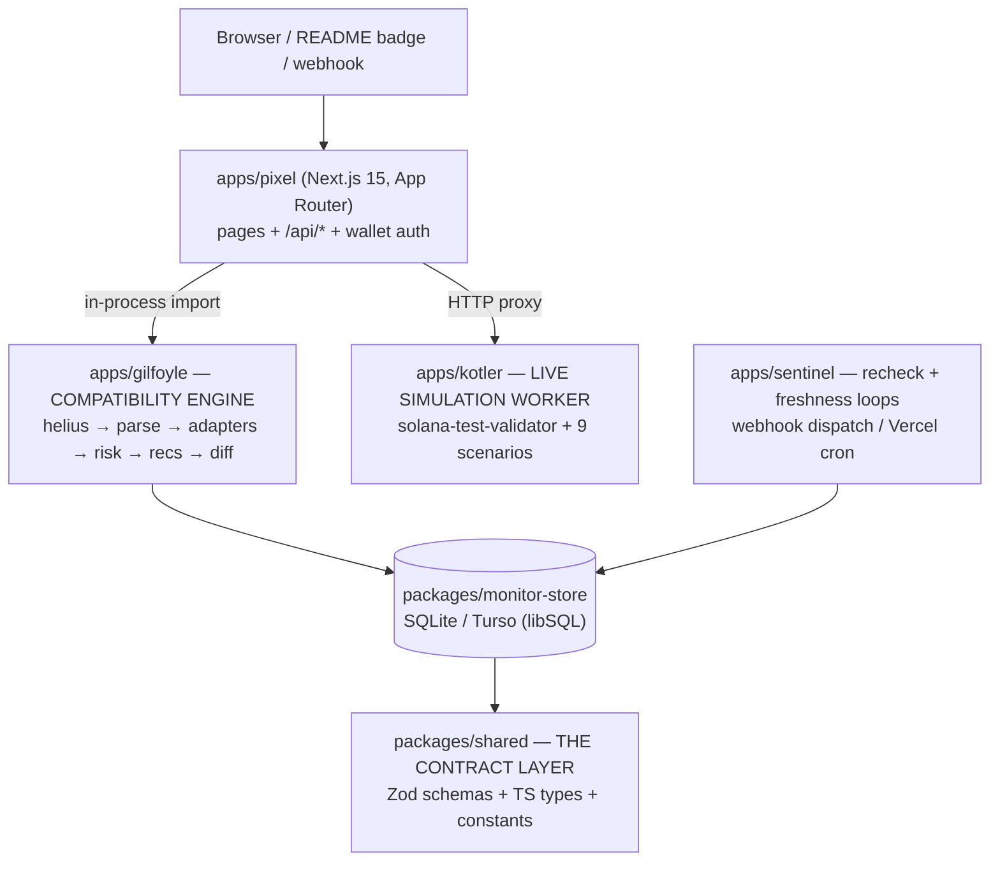
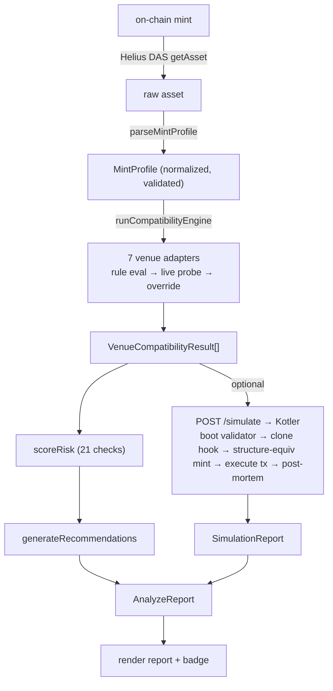
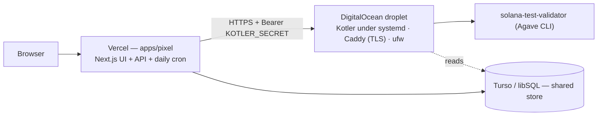

# Tarani — Know before you launch

**Token-2022 compatibility intelligence for Solana.**

> Paste any mint address. Tarani tells you **where your token works, where it breaks, and what to fix — before you launch** — with evidence-backed verdicts across 7 ecosystem venues, ranked risks and remediations, and an optional live on-chain simulation that runs _real_ transactions.

_Built by Vansh Chitransh for the SuperDev Fellowship 2026 capstone (Token-2022 track). Honest maturity: this is a **v0.5** — the core works end-to-end; depth (probe coverage, simulation breadth, public API) is still on the roadmap. This document explains **why** the product exists, **what** it does, and **how** it's built._

---

## How to read this doc

This is structured in three parts, each answering one question:

1. **Why Tarani** — the market and the problem. _Why does a product like this need to exist?_
2. **What Tarani is** — the product, its scope, and how it maps onto the problem. _What does it actually do?_
3. **How it's built** — the architecture, the engineering decisions and the trade-offs behind them, and the real challenges we hit and resolved. _How was it made, and why this way?_

---

---

# Part 1 — Why Tarani

## 1.1 The macro: real-world assets are flooding onto Solana

Tokenized real-world assets (RWAs) on Solana are in a steep growth curve:

| Signal                           | Figure                                                           | Source                                                             |
| -------------------------------- | ---------------------------------------------------------------- | ------------------------------------------------------------------ |
| RWA all-time high (Mar 2026)     | **~$1.8B** ($1.82B)                                              | rwa.xyz; HokaNews citing Cointelegraph                             |
| RWA market size today (May 2026) | **~$2.6B** across **1,843 assets**, **232,645 holders**          | [app.rwa.xyz/networks/solana](https://app.rwa.xyz/networks/solana) |
| Growth & ranking                 | **325% growth in 2025**; Solana is the **3rd-largest RWA chain** | CoinEdition citing rwa.xyz                                         |

**The takeaway:** thousands of new, high-value tokens are launching on Solana, and the trend is accelerating — not a one-off spike. Every one of them has to decide _how_ to be a token.

## 1.2 The mechanism: more and more of them use Token-2022

Increasingly, those tokens are built on **SPL Token-2022**, the successor token program whose headline feature is **~20 mint "extensions"** that bolt programmable behavior onto a token:

`transferFeeConfig` · `transferHook` · `confidentialTransfer` · `permanentDelegate` · `nonTransferable` · `defaultAccountState` (default-frozen) · `interestBearingConfig` · `scaledUiAmountConfig` · `pausable` · `metadataPointer` / `tokenMetadata` · `mintCloseAuthority` · … and more.

Extensions are exactly why issuers pick Token-2022: a stablecoin wants a freeze authority and a compliance hook; an RWA wants a transfer fee and a permanent delegate for clawbacks; a points token wants non-transferability. **The extensions are the value.**

## 1.3 The gap nobody owns: every venue handles extensions differently

Here's the problem nobody tells you: **a token that initializes perfectly on-chain can still be silently un-routable on one venue, un-poolable on another, and unrenderable in a third.** Each downstream protocol decides for itself which extensions it tolerates — and the docs lag reality:

| Venue       | The catch                                                                                                                                                                 |
| ----------- | ------------------------------------------------------------------------------------------------------------------------------------------------------------------------- |
| **Jupiter** | Didn't support Token-2022 until **~June 2023**; today still **won't let transfer-fee tokens use Limit or Recurring orders** (the creator can change the fee at any time). |
| **Raydium** | **Blocks permanent-delegate tokens from permissionless pools.**                                                                                                           |
| **Orca**    | Puts risky extensions behind a **manual TokenBadge allowlist** — support is case-by-case.                                                                                 |
| **Phantom** | Only shipped proper Token-2022 support on **Dec 14, 2023** — a valid token could be unrenderable in a major wallet.                                                       |

So the same token can work in one place and just be broken in another, and **there is no single source of truth** telling a creator where. The compatibility matrix is roughly **~20 extensions × 7 venues** — and it changes quietly, by hand, on each venue's timeline.

## 1.4 The stakes: this hits the biggest tokens, not edge cases

This isn't theoretical. It already affects the flagship tokens on Solana:

- **PayPal's PYUSD** — a Token-2022 token built with a **transfer fee, a transfer hook, _and_ a permanent delegate**. Roughly **$2–3B on Solana** (≈$3.06B all-chain mcap, ~60% on Solana) and **~150K holders** — running straight into these venue restrictions.
- **xStocks** (tokenized stocks) — **over $182M on Solana, 57,000+ holders**, using **seven extensions**, so it's gated across venues too.

> **The one-sentence problem:** _You can deploy a token that's perfectly fine on-chain, and only discover **after** launch that it's un-tradeable, un-poolable, or invisible somewhere that matters._

## 1.5 Why now

The wave of valuable Token-2022 launches is here, the extension surface is large and combinatorial, venue support is fragmented and lagging, and **no tool answers "where will this break?" before deployment.** That's the gap Tarani fills.

---

---

# Part 2 — What Tarani is

## 2.1 In one line

**Tarani is a pre-launch compatibility scanner for Token-2022 tokens.** Paste a mint address (or describe a token you haven't deployed yet) and it produces an instant, evidence-backed report of where the token will work, where it will break, why, and how to fix it.

The whole product converges on one canonical output: the **`AnalyzeReport`**.

## 2.2 What it actually does

| Capability                   | What you get                                                                                                                                                                                                            |
| ---------------------------- | ----------------------------------------------------------------------------------------------------------------------------------------------------------------------------------------------------------------------- |
| **Compatibility report**     | A verdict for each of **7 venues** (Jupiter, Raydium, Orca, Phantom, Solflare, Solscan, Solana Explorer): `supported` / `partial` / `conditional` / `blocked`, each with a **confidence level** and **cited evidence**. |
| **Live protocol probes**     | For 3 venues (Jupiter, Raydium, Orca), the static verdict is refined against **real, live protocol state** — catching permissioned/whitelisted pools that rules alone can't see.                                        |
| **Risk scoring**             | **21 deterministic checks** across authority, extension, compatibility, and metadata dimensions, ranked by severity.                                                                                                    |
| **Remediations**             | Each flagged risk maps to an actionable fix you can apply _before_ shipping.                                                                                                                                            |
| **Live on-chain simulation** | Optionally boots a real validator and runs **actual transactions** (transfer, fee, freeze, hook, …) against a token that mirrors your extension setup — then reads the program logs to show what truly happened.        |
| **Prelaunch mode**           | Analyze a token _before it exists on-chain_ by describing its hypothetical extension/authority config.                                                                                                                  |
| **Monitoring & alerts**      | Track a mint; get a **webhook** when a venue's support for it changes.                                                                                                                                                  |
| **Embeddable badge**         | A single-grade (A/B/C/F) SVG status badge any launchpad or explorer can drop into a README or page.                                                                                                                     |

## 2.3 The three pillars

Tarani is built on three layers of increasing fidelity — each one a stronger form of evidence than the last:

1. **Pillar I — The `MintProfile` engine.** Turn a raw mint into a clean, normalized, validated profile of every extension, authority, and metadata field.
2. **Pillar II — The compatibility engine.** Evaluate that profile against hand-maintained venue rules, refine select verdicts with live probes, score risk, and generate recommendations. _Tells you what **should** happen._
3. **Pillar III — Live simulation (Kotler).** Execute real Token-2022 transactions on an ephemeral validator and post-mortem the logs. _Proves what **does** happen._

## 2.4 Scope — what's in, and (honestly) what's out

Tarani is deliberately scoped, and the boundaries are stated plainly rather than hidden:

**In scope (shipped):**

- ✅ Paste-a-mint compatibility report across 7 venues, every verdict carrying source + confidence + evidence.
- ✅ Live HTTP probes for **3 of 7** venues (Jupiter / Raydium / Orca).
- ✅ Live on-chain simulation via an ephemeral `solana-test-validator`.
- ✅ Prelaunch (configure-before-you-deploy) analysis through the _identical_ engine.
- ✅ Poll-based monitoring + diffing + HTTPS-only webhook alerts.

**Out of scope (by design or roadmap):**

- ⛔ **Not a mainnet fork.** Kotler does **not** fork mainnet ledger slots or clone the live mint account — it _re-creates_ a structurally-equivalent mint locally (see §3.5). High fidelity, but a harness, not a fork.
- ⛔ **Not live probes everywhere yet.** 4 of 7 venues are pure rule evaluators with no live ground-truth confirmation.
- ⛔ **Not real-time alerts.** Monitoring is poll-based (a recheck loop / daily cron), so a change is caught at the next tick, not instantly.
- ⛔ **Tarani does not deploy or mint your token** — it only analyzes.

> **Honesty note on the demo fixtures.** The bundled PYUSD test fixture carries a transfer fee configured at **0 bps (inactive)** and omits the transfer-hook slot, so it doesn't literally carry every extension the live mainnet PYUSD does. The 0-bps case is intentional — it's what makes Tarani's _rate-aware_ risk checks meaningful (a present-but-dormant fee should be `INFO`, not a scary `MEDIUM`).

## 2.5 How it maps onto the problem

| Problem from Part 1                                                     | Tarani's answer                                                                                                   |
| ----------------------------------------------------------------------- | ----------------------------------------------------------------------------------------------------------------- |
| "Will this work on Jupiter / Raydium / Orca / Phantom / …?"             | Per-venue verdict with confidence + evidence (Pillar II).                                                         |
| "The docs lag; rules go stale."                                         | Every venue rule has a `last_updated` date; a **freshness watchdog** flags stale (≥60d) / critical (≥120d) rules. |
| "Static rules can't see permissioned pools (xStocks, Orca TokenBadge)." | **Live probes**: a confirmed live market overrides the rule to `supported`.                                       |
| "Will a transfer actually go through? Will a freeze block it?"          | **Kotler** runs the real transaction and reports the on-chain outcome + error code.                               |
| "I haven't launched yet."                                               | **Prelaunch** analyzes a hypothetical config through the same engine.                                             |
| "A venue changed its policy after I launched."                          | **Monitoring** diffs snapshots and fires a webhook on change.                                                     |

---

---

# Part 3 — How it's built

This is the part that matters most: the architecture, the engineering decisions (and _why_ each one over the alternatives), and the real challenges we hit and how we resolved them.

## 3.1 System architecture (high-level)

Tarani is a **Bun workspace monorepo** of four applications and three packages. The defining idea: a single **contract package** (`@tarani/shared`) owns every Zod schema and type, and every other module is a typed consumer of it. There is one source of truth for the shape of data, and everything converges on the **`AnalyzeReport`**.



**End-to-end data flow:**



**The four apps and three packages, at a glance:**

| Module                   | Role                                                                             |
| ------------------------ | -------------------------------------------------------------------------------- |
| `packages/shared`        | **The contract layer** — every Zod schema, TS type, and constant.                |
| `packages/monitor-store` | Driver-abstracted SQLite/Turso store + webhook dispatch + atomic rate-limit.     |
| `packages/test-fixtures` | Real (USDC, PYUSD, transfer-hook) + synthetic mints for tests.                   |
| `apps/gilfoyle`          | **The compatibility engine** — parse → adapters → risk → recommendations → diff. |
| `apps/kotler`            | **The live simulation worker** — boots a validator, runs real transactions.      |
| `apps/pixel`             | **The web app** — Next.js 15 UI + API routes + wallet auth + badge.              |
| `apps/sentinel`          | **The monitoring worker** — recheck + freshness loops, webhook dispatch.         |

---

## 3.2 The contract layer — why one package owns all the types

**Decision:** a single package (`@tarani/shared`) defines every schema as a **Zod schema**, and the TypeScript types are `z.infer`red from those schemas — so the runtime validator and the compile-time type can never drift apart.

**Why this approach:** the system is a pipeline of independent modules (parser → engine → risk → simulation → UI) that hand structured data to each other across process and network boundaries. If each module declared its own types, the boundaries would silently rot. With one contract package, a change to the report shape is a single edit that the whole monorepo type-checks against, and the same schema both _validates at the boundary_ and _types the code_.

---

## 3.3 Pillar I — The `MintProfile` generation engine

> Location: `apps/gilfoyle/src/helius/` and `apps/gilfoyle/src/parser/`

This pillar turns a raw on-chain mint into a clean, normalized, validated `MintProfile`.

### Decision: consume an indexer (Helius DAS), don't hand-decode raw TLV bytes

A naive analyzer issues `getAccountInfo` and hand-decodes the raw account buffer, walking the Token-2022 **TLV (type-length-value)** extension region byte-by-byte. That's brittle: extension layouts version independently, and you'd re-implement the on-chain TLV walker for every new extension.

**What we chose:** source state from the **Helius Digital Asset Standard (DAS) API** (`getAsset`). Helius does the TLV decode server-side and returns structured `mint_extensions`, `token_info`, `authorities`, and `content.metadata`. The parser's job becomes **normalization and semantic interpretation**, not byte-walking.

> **Trade-off (accepted):** this trades a layout dependency for an RPC dependency, and Helius's field shapes aren't stable. The code carries explicit workarounds for provider quirks — e.g. `TokenMetadata` is emitted as `metadata` (not `token_metadata`), `Pausable` as `pausable_config`, and the active transfer fee nested under `newer_transfer_fee`. (Two of those quirks caused real bugs — see §3.8.)

### Decision: carry `supply` as a _string_, not a number

A u64 supply can exceed `Number.MAX_SAFE_INTEGER` (2⁵³−1). Serialized as a JS `number`/float it would **silently corrupt** large-supply tokens. So `supply` is carried as a `/^\d+$/` decimal string end-to-end, JSON-safe across every boundary. (The same reasoning makes `maximumFee` in the transfer-fee reader a `bigint`.)

> **Trade-off:** consumers must parse to `BigInt` before doing arithmetic.

### Decision: accumulate warnings, never throw

`parseMintProfile` is a **pure function** composing three normalizers (`normalizeExtensions`, `normalizeAuthorities`, `normalizeMetadata`). Each collects non-fatal `ParserWarning`s and returns a best-effort, schema-valid profile with safe defaults rather than aborting on one weird field.

**Why:** one unknown extension or a missing symbol shouldn't kill the analysis of an otherwise-readable mint — the risk engine and venue evaluators can still run on the partial profile, and the warnings surface exactly what was degraded.

> **Trade-off:** defaults can mask problems (a malformed authority coerces to `null`, which reads identically to a genuinely _renounced_ authority). Consumers must read the `warnings[]` array to tell "absent" from "renounced".

The result is validated against `mintProfileSchema` before it leaves the engine.

---

## 3.4 Pillar II — The compatibility engine

> Location: `apps/gilfoyle/src/adapters/`, `.../rules/`, `.../risk/`

This is a **declarative rule + live-probe + override** pipeline. Each venue's behavior is a hand-maintained JSON rule; an evaluator interprets a `MintProfile` against it; select adapters refine the verdict with live probes; a manual override layer is the final escape hatch.

### Decision: rules-as-data (JSON), not hardcoded TypeScript

**What we chose:** one JSON file per venue (`rules/venues/*.json`) validated by a draft-07 JSON Schema in CI, plus a runtime **freshness model** computed from each file's `last_updated` date (stale at 60d, critical at 120d).

**Why:** JSON rules can be edited/reviewed by non-engineers, diff cleanly, get a build-time correctness gate, and — crucially — turn the _inevitable_ drift of hand-maintained rules into an **observable signal** (freshness) instead of silent staleness.

> **Trade-off:** schema validation is a separate build step, not enforced at runtime load (the loader imports the JSON with an `as VenueRule` cast), so an edited file could load malformed in a context where the validation script didn't run.

### Decision: fail-pessimistic "worst-wins" status aggregation

When a venue has multiple per-extension verdicts, the venue-level status is the **worst** one, over a fixed severity lattice:

```
blocked (5)  >  conditional (4)  >  partial (3)  >  unknown (2)  >  supported (1)
```

`reduce` picks the highest rank. An extension-free token is `supported` by construction; an all-unrecognized set returns `unknown`.

**Why:** a single blocking extension makes the token untradeable at that venue regardless of how many other extensions are fine — the aggregate must reflect the _worst_ constraint. `unknown` deliberately outranks `supported` so an unrecognized extension is never optimistically reported as fine.

> **Trade-off:** a token that's 90% supported but has one blocked extension reads as `blocked` at the venue level — harsher than the nuanced per-feature picture (mitigated by also exposing per-scope breakdowns).

### Decision: confidence = the _minimum over the drivers_

Confidence is the lowest confidence **only among the verdicts whose status equals the chosen overall status** (the "drivers") — not the min over all verdicts.

**Why:** confidence should describe how sure we are of _the status we actually reported_. If `blocked` is driven by two features, our confidence in `blocked` is only as strong as the weaker of those two; a high-confidence `supported` verdict on an unrelated extension is irrelevant. This stops a high-confidence verdict from inflating the confidence of an unrelated result.

### Decision: a strict precedence chain — heuristic → probe → override

A verdict is produced in three layers, each re-tagging `result.source`:

1. **`heuristic`** — the rule evaluation.
2. **`probe`** — live protocol refinement (DEX adapters only).
3. **`override`** — a manual escape hatch, applied **last** and unconditionally.

**Why:** a clear authority order — automated heuristics first, observed reality next, human judgment final. The override runs _after_ the probe, so a human decision can't be re-overturned by a flaky market check.

> **Trade-off:** overrides are blunt (they force a status outright) and bypass the probe, so a stale override can mask a now-tradeable market — mitigated by shipping the override file empty and requiring a non-empty reason.

### Decision: "a confirmed live market is ground truth" — asymmetric probe reconciliation

The single most important rule in the engine. When a static rule disagrees with a live probe, the reconciliation is **deliberately asymmetric** (`reconcileProbe`):

- **`exists`** → overrides _any_ worse-than-`supported` verdict up to `supported` (`source: probe`, `confidence: high`). _This is what catches permissioned/whitelisted pools the rules can't see — xStocks on Raydium, an issued Orca TokenBadge._
- **`absent`** → only softens an over-optimistic `supported` down to `partial`. **Absence never fabricates a `blocked` verdict** — a token may simply not be listed yet.
- **`unknown`** → leaves the verdict completely untouched. **A flaky upstream never degrades the report.**

This relies on a three-state `ProbePresence` (not a boolean): only a _definitive_ negative (Jupiter HTTP 400 `TOKEN_NOT_TRADABLE`; Raydium `success:true` with `count 0`) maps to `absent`; every transient failure (429, 5xx, timeout) maps to `unknown`. Collapsing transient failures into "no route" would let a rate-limit fabricate a false `partial`.

| Adapter     | Probe                                                                       | Signal                                                          |
| ----------- | --------------------------------------------------------------------------- | --------------------------------------------------------------- |
| **Jupiter** | `lite-api.jup.ag/swap/v1/quote`                                             | HTTP 400 `TOKEN_NOT_TRADABLE` ⇒ no route; transient ⇒ `unknown` |
| **Orca**    | `api.mainnet.orca.so/v1/whirlpool/list` (≈18 MB, process-cached, 5-min TTL) | whirlpool present ⇒ live market                                 |
| **Raydium** | `api-v3.raydium.io/pools/info/mint` (mint-scoped)                           | `count > 0` ⇒ pool exists                                       |

### Risk scoring (21 checks) and recommendations

`scoreRisk(profile, compatibility)` runs **21 deterministic checks** across four modules — Authority, Extension, Compatibility, Metadata — dedups by `id`, and sorts by `(severity, category)`. A key principle here (learned the hard way — see §3.8): **only flag what the Token-2022 program actually enforces.** The transfer-fee finding is _rate-aware_; combinations that merely coexist inertly are `LOW`/`INFO`, not `CRITICAL`.

`generateRecommendations(risks)` maps each `RiskFinding.id` to a remediation template, back-linked via `riskIds`.

**Derived badge grade** (over _n_ venues, _b_ blocked, _k_ supported): `F` if `b > 0`; `A` if `b = 0 ∧ k/n ≥ 0.8`; `B` if `b = 0 ∧ 0.5 ≤ k/n < 0.8`; else `C`.

---

## 3.5 Pillar III — Live on-chain simulation (Kotler)

> Location: `apps/kotler/src/` — a standalone Bun HTTP service. **This is the project's technical moat.**

Rules and probes tell you what _should_ happen. Kotler proves what _does_ happen by executing real transactions against a real validator.

### The central decision: build a _structure-equivalent_ mint, don't fork mainnet

Two naive approaches both fail:

1. **Forking / cloning the live mint** (`--clone <mint> --url mainnet`) copies the on-chain _bytes_ but **not the authority private keys**. Kotler could _read_ frozen/fee state but could never mint, freeze, or thaw to _actively prove_ behavior — and it would couple every simulation to a live mainnet round-trip.
2. The real mint/freeze/fee authorities are **third-party keypairs Kotler will never hold.**

**What we chose:** `createStructureEquivalentMint` rebuilds a fresh **local** Token-2022 mint that is _structurally identical_ to the target — same decimals, same extension set (sized via `getMintLen`), same per-extension init params — but with a **locally-generated payer keypair installed as mint, freeze, and transfer-fee authorities.** Because Kotler _owns_ the authorities on its clone, the scenarios can actively mint, freeze, thaw, and transfer to prove behavior on-chain.

> **Trade-off / honest scope:** `transferHook` and `confidentialTransfer` are deliberately _not_ reconstructed (the hook program may not exist in the test env), and memo enforcement isn't exercised on the clone. Where a scenario can't be reproduced locally, it falls back to heuristic analysis and **labels itself** `mode: "analysis"`. Fidelity is high, but it is a **structure-equivalent harness, not a mainnet fork.**

### The validator lifecycle (`runLive`)

1. **Free-port scan** — probe `127.0.0.1:8899–8998` with a raw TCP connect to find an open RPC port (concurrent runs would otherwise collide on 8899).
2. **Boot** — `solana-test-validator --rpc-port <p> --quiet [--clone <hookProgramId> …]`. A hook-bearing mint adds its program id to the clone set.
3. **Health gate** — poll `getHealth` every 500 ms (30 s ceiling) until `"ok"` before sending any transaction — the validator has no synchronous "ready" signal.
4. **Funding** — generate a fresh payer and airdrop 2 SOL on the _local_ validator.
5. **Build** the structure-equivalent mint.
6. **Execute** each selected scenario as a real `sendAndConfirm`ed transaction.
7. **Teardown** — `try/finally` guarantees `stopValidator(SIGTERM)` even on failure; the ledger is ephemeral.

> **Known fragile seams (named honestly):** the free-port scan is TOCTOU (a gap between probe and the validator's later bind); `--clone` is passed without `--url`, so cloning a hook program depends on the validator's default mainnet egress; teardown is best-effort SIGTERM with no SIGKILL escalation. The `/run` endpoint is gated behind a `Bearer KOTLER_SECRET` because booting a validator is expensive.

### The 9 scenarios and the _mode trichotomy_

`SCENARIO_REGISTRY` holds **9 scenarios**, each with a `heuristic` and a `live` path: `transfer`, `transfer_fee`, `transfer_hook`, `memo_required`, `associated_token_create`, `freeze_check`, `metadata_check`, `swap`, `wrap_sol`.

Crucially, not every scenario can be _proven_ by a local transaction — so every result is honestly labeled with a **`mode`**:

- **`validator`** — a real transaction on the local test validator (transfer, fee, freeze, …).
- **`api`** — an external protocol probe (`swap` → Jupiter Quote; `wrap_sol` → Raydium pools). _Kotler does not stand up a DEX on the throwaway validator._
- **`analysis`** — static analysis only, no execution (`metadata_check`).

The whole live path degrades gracefully: if no validator binary exists or boot times out (`ValidatorBootTimeoutError`), it runs the full heuristic suite and stamps `validatorMode: "heuristic"`. `KOTLER_FORCE_HEURISTIC=true` forces this deterministically (used in CI and on machines without the Solana CLI).

### State post-mortem

A confirmed-transaction failure carries an untyped `logs` array, not a structured error. `logParser.ts` recovers the cause with two pure regexes:

```typescript
const LOG_ERR_RE = /Error:\s*(.+)/i;
const FAILURE_CODE_RE = /custom program error:\s*(0x[0-9a-f]+|\d+)/i;
```

A blocked transfer therefore surfaces as `outcome: "blocked"` with the program's actual `custom program error` code — **concrete on-chain evidence of an extension gate, not a guess.**

---

## 3.6 Monitoring, store & alerts

> Location: `packages/monitor-store/` + `apps/sentinel/`

### Decision: a driver-abstracted store with two backends

A minimal `DbDriver` interface (`prepare → {get, all, run}`, `exec`) with two adapters: **Turso/libSQL** (production — survives Vercel's ephemeral cold starts) and **better-sqlite3** (local/test). The store layer is driver-agnostic; the host picks a driver at boot.

> **Trade-off:** lowest-common-denominator SQL strings (no query builder, rows cast `as MintRow`), and both backends must behave identically for the same SQL.

### Decision: dedup rechecks to one shared snapshot per mint

A mint's compatibility is a property of the _token_, not of _who's watching_. `monitored_mints` is **unique on `(subscriber_id, mint)`**, but `listDistinctMints()` drives the recheck loop — so a mint watched by _N_ users is fetched + analyzed + snapshotted **exactly once**.

### Decision: an _atomic_ sliding-window rate limit

Instead of a check-then-act `COUNT` then `INSERT` (a TOCTOU race — see §3.8), admission is a **single atomic statement**:

```sql
INSERT INTO rate_limit_hits (bucket_key, ts)
SELECT ?, ? WHERE (SELECT COUNT(*) FROM rate_limit_hits
                   WHERE bucket_key = ? AND ts >= ?) < maxRequests
```

Because SQLite/libSQL serializes writers, the embedded `COUNT` and the `INSERT` evaluate against one consistent snapshot — race-free. Admission is decided by `rowsAffected > 0`. The limiter also **fails open** (a store outage disables rate-limiting rather than taking down the API).

### Decision: HTTPS-only, per-hook-isolated webhooks

`postToWebhooks` fans out with `Promise.all` over per-hook handlers that each catch everything, so **one dead endpoint never sinks the batch**. Every URL is re-checked to be `https://` _at delivery time_ (defense in depth), with a 5 s timeout. Retries/dead-letter are deliberately omitted (a naive retry without idempotency keys would double-deliver) → at-most-once, best-effort.

### Decision: the sentinel runs as _both_ a long-lived worker and a serverless cron

The same recheck logic runs two ways: a standalone Bun process with two overlap-guarded `setInterval` loops (recheck every 60 s, freshness every 24 h, with in-memory consecutive-failure backoff), **and** a Vercel cron hitting `/api/sentinel/tick` (`0 6 * * *`), gated by `CRON_SECRET`.

> **Why both:** the cron gives zero-ops daily monitoring co-located with the UI; the standalone worker adds what a stateless cron can't — higher frequency, backoff, and a freshness watchdog that dedups alerts on the _set_ of stale rules so a persistently-stale rule doesn't re-alert every cycle.

---

## 3.7 The web app, auth & deployment topology

> Location: `apps/pixel/`

### Decision: wallet sign-in, not OAuth or passwords

The audience already holds a Solana wallet, so **the wallet is the identity.** Flow: client requests a nonce → signs a human-readable message (which states it "will not trigger a transaction or cost any fees") with its ed25519 key → server verifies via constant-time `nacl.sign.detached.verify` → issues a **stateless HMAC session cookie** `base64url(address).<expiryMs>.<hmac>`. No passwords to leak, no IdP, no per-request session table.

> **Trade-off:** auth is bound to wallet custody (no email recovery); `AUTH_SECRET` becomes a single high-value secret (the app hard-fails at boot in prod if it's missing or < 16 chars); stateless tokens can't be revoked before expiry short of rotating the secret.

### Decision: split the two compute backends by execution profile

- **`/api/analyze`** imports **gilfoyle in-process** — it's pure static analysis (RPC fetch + rule eval), cheap and stateless, so it belongs inline in the Vercel function.
- **`/api/simulate`** is a thin **HTTP reverse-proxy** to a separate **Kotler** service, because Kotler spawns a `solana-test-validator` child process and **cannot run in Vercel's serverless sandbox** — it needs the Solana CLI binary on a real host. The proxy also enforces body-size/rate-limit/validation _before_ spending a validator boot, and injects the `Bearer KOTLER_SECRET` server-side so the secret never reaches the browser.

### Production topology



- **Pixel** (UI + API + cron) → **Vercel** (Root Directory `apps/pixel`).
- **Kotler** → a **DigitalOcean droplet** with the Agave Solana CLI, containerized via a Dockerfile that smoke-tests the binary at build, fronted by **Caddy** (TLS), run under **systemd**, firewalled with **ufw**. (`.dockerignore` excludes pixel/sentinel — only Kotler is containerized.)
- The store is **Turso/libSQL**, shared by both.

> **Why the split:** Kotler needs the actual validator binary on the host — something Vercel's serverless sandbox can't provide (the path-probing fallback even special-cases systemd's restricted PATH). **Trade-off:** two platforms, two deploy pipelines, and a shared-secret + cross-origin HTTPS contract that must stay in sync.

---

## 3.8 Challenges we hit, and how we resolved them

These are the real war stories — bugs and hard problems found during the build, each reconstructed from the actual diffs and verified against current source. _(Every claim below survived an adversarial fact-check pass against the code; over-stated versions were dropped.)_

### ① The freeze test that never froze (and the `0x10` droplet crash)

- **Symptom:** on the production droplet, the `freeze_check` _live_ path could never actually exercise a freeze — its `live()` literally `return heuristic(...)`, echoing the static verdict. Worse, any token using `DefaultAccountState = Frozen` crashed at `InitializeMint`.
- **Root cause:** the structure-equivalent clone was always built with a **`null` freeze authority.** Token-2022's `InitializeMint` _requires_ a non-null freeze authority for any mint that will freeze accounts (including default-frozen mints) — else it aborts with **custom error `0x10`** ("this token mint cannot freeze accounts"). With no freeze authority there was also nothing to freeze.
- **Resolution:** compute `needsFreezeAuthority = (freeze.address !== null) || hasDefaultAccountState`, and install the local payer as the clone's freeze authority when true _(commit `547a2c6`)_. Then rewrite `freezeCheck.live()` to actually mint into a funded account, `freezeAccount` it, and prove the subsequent transfer is **rejected on-chain** with `AccountFrozen` _(commit `b226475`)_. It deliberately uses `transferChecked` (not plain `Transfer`) so a _fee_ mint can't misattribute the rejection.

### ② Replicating a transfer fee on a throwaway mint ("fee replication")

- **Symptom:** the live `transfer_fee` scenario **always reported 0 withheld fee**, and the heuristic reported 0% for genuinely fee-bearing tokens.
- **Root cause:** Helius DAS nests the active rate under `newer_transfer_fee.{transfer_fee_basis_points, maximum_fee}` (snake_case), but the **mint builder _and_ the scenario heuristic** read flat camelCase keys off the top level — which never exist in the Helius shape — so both defaulted to 0. The clone was therefore initialized with a 0-bps fee, guaranteeing 0 withheld. _(The risk-engine reader already read the nested key correctly — it was only refactored to share the new code, not fixed.)_
- **Resolution:** add a single source of truth, `readTransferFeeConfig` (`parser/transferFee.ts`), that prefers the nested object and tolerates snake/camel + string/number. The clone is now built with the **real** rate, the live path mints, transfers, re-reads the recipient, and computes `withheld = amount − received` — a genuine on-chain measurement. The heuristic gained an explicit 0-bps branch ("present but currently 0%") instead of a false fee warning _(commit `b226475`)_.

### ③ The Raydium firehose

- **Symptom:** the Raydium probe was slow and frequently degraded to `unknown`.
- **Root cause:** it fetched the legacy `/v2/main/pairs` endpoint — **every pair on Raydium** (the code comments it as ~238 MB) — and filtered client-side, so the download rarely finished inside the 5 s timeout.
- **Resolution:** migrate to the mint-scoped v3 endpoint `api-v3.raydium.io/pools/info/mint?mint1=<mint>&pageSize=1`, which returns only pools containing that mint (sub-second). Parse the `{success, data:{count}}` envelope: `count > 0` ⇒ pool exists _(commit `224d323`)_.

### ④ One probe-reconciliation contract instead of three divergent ones

- **Symptom:** each DEX adapter folded its probe into the verdict with its _own_ incomplete logic — Jupiter only softened on a missing route but never upgraded when a route existed; Orca only upgraded but never softened; Raydium changed nothing. A token actually trading in a permissioned pool could still be reported `blocked`.
- **Root cause:** there was no single contract for combining a rule verdict with a probe result.
- **Resolution:** extract `reconcileProbe(base, presence, evidence)` as the single source of truth, called by all three adapters, with the asymmetric semantics described in §3.4 — covered by an 11-case truth table over all 5 statuses _(commit `5ae1dd1`)_.

### ⑤ Pruning false-`CRITICAL` risk findings (trust erosion)

- **Symptom:** the risk engine flagged `NonTransferable + TransferHook`, `NonTransferable + TransferFee`, `Confidential + TransferHook/Fee` as **`CRITICAL` "will cause transaction failures."** These combinations actually initialize fine on-chain. Hook findings even fired on tokens whose hook slot had _no program_ wired in (e.g. xStocks).
- **Root cause:** the checks asserted incompatibilities the Token-2022 program **does not enforce.** Per the program's own `check_for_invalid_mint_extension_combinations`, the _only_ unconditional mutual exclusion is `ScaledUiAmount + InterestBearing`, plus `Confidential + TransferFee` _requiring_ the co-requisite fee-config extension. The others coexist (inert, or amount-blind).
- **Resolution:** rewrite the extension checks to flag as `CRITICAL` **only** the program-enforced cases; downgrade the coexisting pairs to `LOW`/`INFO`; and only fire a hook finding when a real `programId` is wired in _(commit `5ae1dd1`)_. **Accurate severities beat scary ones — false positives erode trust.**

### ⑥ A check-then-act rate-limit race

- **Symptom:** under concurrency, the rate limiter could over-admit — 5 requests racing a limit of 2 could all pass.
- **Root cause:** a `SELECT COUNT(*)` and a separate `INSERT` as two statements — a classic TOCTOU race. Neither driver even reported how many rows were written.
- **Resolution:** collapse them into one atomic `INSERT … SELECT … WHERE (SELECT COUNT(*)…) < max` (§3.6), and normalize `run()` to return `rowsAffected` so admission is `inserted > 0`. A test asserts exactly 2 of 5 racing requests are admitted _(commit `d44ebf2`)_.

### ⑦ Vercel couldn't find the rule files at runtime

- **Symptom:** pixel's `analyze`/`badge`/`sentinel` API routes threw on Vercel.
- **Root cause:** the rules loader did `fs.readFileSync` of each venue JSON and compiled an Ajv validator **on the hot path**, resolving paths from `import.meta.url` — paths that **don't exist in Vercel's bundled serverless output.**
- **Resolution:** rewrite the loader to use **static ESM imports** of all 7 venue JSON files into an in-memory record (zero `fs`, zero Ajv at runtime); move schema validation entirely into the standalone `validate-rules.ts` build script. Also removed an unresolvable Vercel secret reference from `vercel.json` _(commits `6a5c436`, `e8a196a`)_.

### ⑧ A publicly-triggerable cron and an over-counting badge

- **Symptom:** two trust issues — (1) `GET /api/sentinel/tick` ran an expensive per-mint Helius-fetch-and-analyze loop with **no authentication**; (2) the badge's "X/Y venues supported" figure was inflated because it counted `supported` **or** `partial`.
- **Resolution:** (1) gate the cron behind a `CRON_SECRET` bearer check (open only when the secret is unset, for local manual triggers) _(commit `0f86a2b`)_; (2) count only `status === 'supported'`, and dedup repeated evidence/notes with a `Set` _(commit `5ae1dd1`)_.

### ⑨ `transferChecked` over plain `Transfer`

- **Symptom:** the baseline `transfer` scenario falsely reported fee-bearing mints as `blocked`.
- **Root cause:** Token-2022 rejects the legacy `Transfer` instruction for fee-bearing mints (the program needs the mint + decimals to compute the fee; the code attributes this to `MintRequiredForTransfer` / `0x1f`). The `transfer` and `transfer_hook` scenarios used plain `transfer`.
- **Resolution:** switch those two scenarios to `transferChecked` (passing `mint.publicKey` + `profile.decimals`), which works for every Token-2022 mint and doubles as a decimals correctness guard _(commit `b226475`)_. _(This is also why `freeze_check` uses `transferChecked` — so the only possible rejection is the freeze, not a misattributed fee error.)_

> **A note on rigor.** While assembling this section, an adversarial verification pass caught and dropped several plausible-but-inaccurate claims — e.g. that the fee bug also broke the _risk engine_ (it didn't — it read the correct key all along), that 5 scenarios were switched to `transferChecked` (only 2 were), and that the log parser was the mechanism behind diagnosing the `0x10` freeze bug (it wasn't — `0x10` was an init-time setup failure). The stories above are the survivors.

---

## 3.9 Testing & CI

```bash
bun run test            # full Vitest suite
bun run test:coverage   # V8 coverage thresholds
bun run check:ci        # lint → typecheck → test:coverage → build
bun run check:freshness # fail if any venue rule is stale (≥60d) / critical (≥120d)
```

- **Coverage floors:** 66% lines/statements, 75% functions, 86% branches. _(The function gap is intentional — per-scenario `live` paths require a booted validator and are excluded from unit coverage.)_
- **Git hooks (Husky):** `pre-commit` runs `lint-staged`; `pre-push` runs the full `check:ci`.
- **GitHub Actions:** a PR/push gate, a Vercel deploy on `main`, and a **daily rule-freshness watch** that turns rule drift into an alert.

---

## 3.10 The engineering thesis, in one paragraph

Tarani is three escalating tiers of _evidence_: a **normalized profile** (what the token is), **rules + live probes** (what venues say and what's actually trading), and a **real on-chain simulation** (what a transaction actually does). Every layer is honest about its own confidence — `heuristic` vs `probe` vs `override`; `validator` vs `api` vs `analysis`; a freshness date on every rule; absence that never fabricates support. The hard part wasn't any single component — it was making each one _truthful about how much it knows_, so a creator can trust the verdict before betting a launch on it.

---

_Source of truth for everything above: the Tarani repo (`README.md`, source under `apps/` and `packages/`, and git history). Market figures are from `script.md` and the sources cited there._
